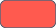
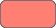
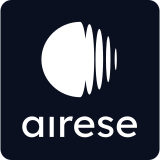

# Airese design system

Everything used to build the Airese app: tokens, type, motion, icons, brand assets and every React Native component, with where each one is used.

**Everything here is built in React Native** (Expo SDK 57, TypeScript). There is no separate Figma library or web component kit: the code is the source of truth. Voice, tone and visual rules are in [docs/BRAND.md](../docs/BRAND.md); what the product does is in [docs/PRD.md](../docs/PRD.md).

| | |
| --- | --- |
| Tokens | [`src/theme/tokens.ts`](../src/theme/tokens.ts) |
| Motion | [`src/theme/motion.ts`](../src/theme/motion.ts) |
| Components | [`src/components/`](../src/components/) (all exported from [`index.ts`](../src/components/index.ts)) |
| Brand assets | [`assets/`](../assets/) |
| **This page, visual version** | **https://nimkarkedar.github.io/easemed-airese/design-system/** (real swatches, type in Montserrat and Inter, icons, motion demos; generated from the code by `scripts/build-design-system.mjs`) |
| See it running | https://nimkarkedar.github.io/easemed-airese/ |

**The rules in one line each:**
- Screens use tokens and components only: no hard-coded colours, sizes, timings or curves.
- See-through colours are a palette colour at an opacity: `alpha(colors.moon, 0.24)`, never a hand-typed `rgba()`.
- Text uses `AppText`; icons use `Icon`.
- Every animation uses a motion preset.
- Everything meets WCAG 2.2 AAA.
- Keep the system small: add a token or component only when a screen needs it.

The swatch images on this page are written from `tokens.ts` every time the design system builds (`npm run design-system`), so they always match the code.

---

## Contents

1. [Colour](#1-colour)
2. [Typography](#2-typography)
3. [Spacing, corners and layout](#3-spacing-corners-and-layout)
4. [Motion](#4-motion)
5. [Icons](#5-icons)
6. [Brand assets](#6-brand-assets)
7. [Components](#7-components)
8. [Hooks and helpers](#8-hooks-and-helpers)
9. [Patterns](#9-patterns)
10. [Accessibility](#10-accessibility)
11. [Dependencies](#11-dependencies)
12. [Housekeeping](#12-housekeeping)
13. [Adding to the system](#13-adding-to-the-system)

---

## 1. Colour

**"Night, with one warm light."** A dark UI for use in bed, with one warm accent used sparingly. One red, Flare, for the loudest snoring in charts and form-error marks; a coral tint of it for the single Book a call button on a repeated pattern.

### Palette

| | Name | Token | Hex | Used for |
| --- | --- | --- | --- | --- |
|  | Night | `colors.night` | `#05070F` | Deepest background, shadows |
|  | Midnight | `colors.midnight` | `#0B1020` | App background |
|  | Deep | `colors.deep` | `#19294E` | Cards, sheets, form groups |
|  | Mist | `colors.mist` | `#B3BDD3` | Muted text (7:1+ on Midnight and Deep) |
|  | Moon | `colors.moon` | `#EEF1F7` | Text, titles |
|  | Breath | `colors.breath` | `#9DB4FF` | Accent: primary buttons, links, focus |
|  | Lamp | `colors.lamp` | `#F4B65F` | The one warm light: the remedy button on an unusual night, the "what it means" wash. Use sparingly. |
|  | Ember | `colors.ember` | `#FFAA5C` | Data: snoring |
|  | Iris | `colors.iris` | `#B9A3FF` | Data: breathing pauses |
|  | Dew | `colors.dew` | `#8EE3CF` | Data: sleep and rest |
|  | Flare | `colors.flare` | `#FF5A4F` | The one red: loudest snoring in charts, form-error marks, the pattern graph line |

### Roles and special colours (what screens use)

| | Role | Token | Value |
| --- | --- | --- | --- |
| | Background | `colors.background` | Midnight |
| | Surface | `colors.surface` | Deep |
| | Text | `colors.text` | Moon |
| | Muted text | `colors.textMuted` | Mist |
| | Accent | `colors.accent` | Breath |
| | Text on accent | `colors.onAccent` | Midnight (also the label on Lamp and `urgentAction` buttons) |
|  | Divider | `colors.divider` | Mist at 18% |
|  | Scrim | `colors.scrim` | Night at 70%, behind sheets |
|  | Error text | `colors.error` | `#FFA49B`, a light tint of Flare (7.5:1 on Deep, 10:1 on Midnight) |
|  | Error mark | `colors.errorMark` | Flare: the field ring and icon, never text |
|  | Urgent action | `colors.urgentAction` | Coral `#FF7F72`, Flare lightened: **only** Book a call on a repeated pattern. Midnight label 7.7:1; 5.3:1 against the wine card |
|  | Breath wash | `colors.tintAccent` | Breath at 16%: profile tile badges, the selected gender tile, the missed-nights note, the Last night tag |
|  | Airese navy | `colors.brand` | `#2E3A5A`: logo, decks, Android icon background |
|  | White | `colors.white` | `#FFFFFF`: logo on the splash, switch thumbs |

### Data colours

One colour per kind of data, the same everywhere: charts, data icons, legends, score rings. **Marks and icons only, never text, buttons or links.** Every chart also labels or shapes its marks, so colour is never the only cue. Checked together on Deep and Midnight for colour-blind separation (ΔE 12+) and 3:1+ contrast.

| | Data | Token | Hex | Soft tint (icon badges, level chips) |
| --- | --- | --- | --- | --- |
|  | Snoring | `colors.dataSnoring` | `#FFAA5C` (Ember) |  `colors.tintSnoring` |
|  | Breathing pauses | `colors.dataBreathing` | `#B9A3FF` (Iris) |  `colors.tintBreathing` |
|  | Sleep and rest | `colors.dataSleep` | `#8EE3CF` (Dew) |  `colors.tintSleep` |
| | Warm wash | `colors.tintWarm` | Lamp at 10% |  for the "what it means" card |

Breath stays out of charts: it's the UI colour, and too close to Iris for colour-blind readers. Earlier nights in charts use a neutral Moon tint (`alpha(colors.moon, 0.14–0.16)`).

### Loudness ramp

`loudness` in tokens: cyan, yellow, orange, Flare red. Each step is pinned to a decibel level, so only truly loud snoring reaches red. **Charts and graphs only**, never text, buttons or UI chrome. Also the Sound Score ring and the calendar rings.

| | Level | Token | Hex |
| --- | --- | --- | --- |
|  | Light | `loudness.light` | `#2EC9EA` |
|  | Moderate | `loudness.moderate` | `#FFD84A` |
|  | Loud | `loudness.loud` | `#FF9A3C` |
|  | Very loud | `loudness.veryLoud` | `#FF5A4F` (Flare) |

### Gradients

| | Name | Token | Stops (top to bottom) | Used for |
| --- | --- | --- | --- | --- |
|  | Splash | `gradients.splash` | `#0B1020` → `#1C3470` → `#225ED8` | Splash, Home and Recording backgrounds (`AmbientGradient`), the record button's fill |
|  | Hero | `gradients.hero` | `#1C3470` → `#19294E` | Verdict card, ordinary and first nights; the no-data card |
|  | Hero, watch | `gradients.heroWatch` | `#3D2E3C` → `#19294E` | Verdict card, unusual night (a warm dusk) |
|  | Hero, urgent | `gradients.heroUrgent` | `#5A1C24` → `#2E1830` | Verdict card, repeated pattern (wine into plum) |

### Verdict moods

The verdict card at the top of a report ([`VerdictCard`](../src/components/VerdictCard.tsx)): card colours, the graph behind the words, and the one button. No icons, no dial: the words and the graph carry it.

| Night | Card | Graph | Button |
| --- | --- | --- | --- |
| Ordinary, first night | `gradients.hero`, soft Breath glow | Breath line, low and nearly flat (real data) | **Keep tracking**, Breath |
| Unusual | `gradients.heroWatch`, soft Lamp glow | Lamp line climbing to tonight (real data) | **Try using a remedy**, Lamp |
| Repeated pattern | `gradients.heroUrgent`, soft Flare glow that breathes | Flare line, a drawn climb across the card (a picture, not data) | **Book a call** with a phone icon, `urgentAction` |

**Readability budget:** behind the words, the card gradient, glow, graph fill (4%), graph line (6 to 14%) and shine together keep Moon body text at 7:1 or more at the card's brightest point (measured 9:1 or better). Below the words the graph fades up to full strength. The glow strengths (10%, 10%, 16%) are capped for the same reason.

---

## 2. Typography

**Montserrat for titles and buttons; Inter for everything you read.** Both from Google Fonts (`@expo-google-fonts/montserrat`, `@expo-google-fonts/inter`). **Two weights only: regular (400) and semibold (600).**

| Variant | Font | Size / line height | Weight | Used for |
| --- | --- | --- | --- | --- |
| `title` | Montserrat | 32 / 40 | Semibold | Page titles, big numbers |
| `headline` | Montserrat | 24 / 32 | Semibold | Onboarding headlines; emoji flags take this size |
| `heading` | Montserrat | 20 / 28 | Semibold | Card and sheet titles, the calendar month |
| `body` | Inter | 16 / 24 | Regular | All reading text (the base), form inputs, Recording screen text |
| `small` | Inter | 14 / 22 | Regular | Secondary detail, labels, legends, section labels |
| `caption` | Inter | 12 / 18 | Regular | The minimum: credits, fine print, tab labels |
| `button` | Montserrat | 16 / 20 | Regular | Button labels |
| `buttonSmall` | Montserrat | 14 / 18 | Regular | Mini buttons in banners and cards |

- **Scale:** steps of about 1.25 (major third): 12 · 14 · 16 · 20 · 24 · 32. **Nothing smaller than 12.**
- **Line height:** at least 1.5× for reading text (WCAG 1.4.8).
- **Title colour:** Moon on every page, including Home over its gradient.
- **Section labels:** one style everywhere (`FormTitle`): small, uppercase, Mist, 1 pt tracking.
- **Action labels under the big buttons:** `body` in Moon ("Tap to start recording", "Tap to stop recording").
- **Big numbers:** one size and weight, with no small units. Compact durations ("7h 36m") only in big numbers; sentences say "1 hr 20 min".
- **Dynamic Type:** text scales with the system setting up to 200% (`maxFontSizeMultiplier={2}` in `AppText`).
- **Digits:** times use tabular figures, so they don't jump as they change.
- **Exception:** the browser-only system alert stand-in uses the system font on purpose (it imitates iOS).

---

## 3. Spacing, corners and layout

### Spacing (4-pt grid), `space`

| Token | Value | Typical use |
| --- | --- | --- |
| `xs` | 4 | Text to its subtitle |
| `sm` | 8 | Icon to label, small gaps |
| `md` | 12 | Between related items |
| `lg` | 16 | Inside rows, between cards in a pair; a tab title's distance below the status bar (`PAGE_TITLE_TOP`) |
| `xl` | 24 | Between sections, card padding |
| `xxl` | 32 | Big separations, footers |
| `gutter` | 20 | **The one screen edge** for every screen (iOS standard); also `PAGE_SIDE` |

### Corners, `radius`

| Token | Value | Used for |
| --- | --- | --- |
| `md` | 12 | Small surfaces, search fields, picker bands |
| `lg` | 16 | Cards, form groups, tiles |
| `xl` | 20 | Banners, the verdict card, the Recording tips box |
| `card` | 24 | Data cards (Recording Details) |
| `sheet` | 28 | Sheet corners (bottom and top sheets), Home banner |
| `pill` | 999 | Buttons, chips, tags, toasts |

Circles use half their own size; that's geometry, not a token.

### Layout constants

| Constant | Value | Where |
| --- | --- | --- |
| Touch target | 44 pt minimum | Every control (buttons 48, mini buttons 36 + 4 pt hit slop, icon buttons 56, setting rows 64, calendar days 48) |
| Tab title row | 16 pt below the status bar, 44 pt tall, control on the right | `PageTitle`, `PAGE_TITLE_TOP`; Home and Reports |
| Title-row control | 44 pt glassy circle (Moon 14%, Moon 24% edge) | `titleControl` in `Avatar.tsx`: the avatar and the calendar button |
| Sticky top bar | 44 pt below the status bar | `DetailPage`; controls in it are plain Breath glyphs |
| Tab bar clearance | 96 pt (`TAB_BAR_CLEARANCE`) | Bottom padding on tab screens; a sticky footer sits 24 pt above the tab bar |
| Form row | 52 pt minimum | `FormInput` |
| Safe areas | `useInsets()` | Every screen |

### Surfaces and depth

The UI is flat: depth comes from colour (Midnight → Deep), not shadows.

- **The exceptions:** a soft glow on the record button and inside the verdict card, a frosted Midnight bar (88%, blurred on web) behind sticky titles, and a soft Night shadow under the Recording tips box.

---

## 4. Motion

**Two presets, one feel: like settling down for the night.** Every animation uses one of these; nothing is hand-tuned per screen. Nothing snaps, bounces or overshoots. Swipes and scrolls follow the finger.

| Preset | Duration | easeOut (arriving) | easeIn (leaving) | easeInOut (between states) | Used for |
| --- | --- | --- | --- | --- | --- |
| `motion.slow` | 1200 ms | `bezier(0.3, 0, 0.2, 1)` | `bezier(0.47, 0, 0.745, 0.715)` | `bezier(0.37, 0, 0.63, 1)` | Arrivals: splash, the recording screen surfacing, charts growing in, score rings filling |
| `motion.fast` | 500 ms | `bezier(0.2, 0, 0, 1)` | `bezier(0.4, 0, 0.8, 0.4)` | `bezier(0.45, 0, 0.2, 1)` | Feedback: sheets (bottom and top), page slides, the record ring after a tap, toasts, the Home banner's next message |

| Helper | Value | Used for |
| --- | --- | --- |
| `motion.ambient` | 9000 ms, sine in-out | Looping background life: the gradient drift, the record button's breathing |
| `motion.attention` | 1800 ms, then 3000 ms rest | The light that runs once round the record ring to invite a tap; the urgent verdict card's breathing glow |
| `motion.glint` | 2400 ms, then 7000 ms rest | A tiny shine that draws the verdict card's graph on load, then glides along the finished line now and then |
| `motion.stagger` | 350 ms | Offset between steps, so things arrive in sequence, not all at once |
| `motion.useNativeDriver` | `false` on web | The native driver isn't available in the browser |

**Reduce Motion** (`useReducedMotion()`) is always respected:
- slides become fades;
- loops hold still;
- charts and the verdict graph are drawn at once, with no shine.

---

## 5. Icons

**Material Symbols (Material 3), Outlined**, weight 400, grade 0, optical size 48, through the `Icon` component only. Paths are copied from the official set (`@material-symbols/svg-400`). `_fill` names are the filled variant, used for selected states.

| Group | Icons |
| --- | --- |
| Navigation | `chevron_left`, `chevron_right`, `keyboard_arrow_down`, `arrow_forward`, `keyboard_double_arrow_right`, `close`, `home`, `home_fill` |
| Actions | `add`, `remove`, `edit`, `edit_note`, `delete`, `call`, `location_on`, `search`, `play_fill`, `pause_fill`, `stop_fill`, `check` |
| Forms | `check_box`, `check_box_outline_blank` |
| Recording and sound | `mic`, `mic_fill`, `graphic_eq`, `airwave`, `monitoring`, `history` |
| Sleep and time | `bedtime`, `bedtime_fill`, `schedule`, `schedule_fill`, `calendar_month`, `bed` |
| Status and trends | `check_circle`, `visibility`, `trending_up`, `trending_down`, `trending_flat`, `warning`, `error`, `info`, `lightbulb` |
| People and settings | `person`, `group`, `notifications`, `settings`, `lock`, `mail`, `description` |
| About you | `male`, `female`, `transgender`, `cake`, `height`, `monitor_weight`, `public` |
| Tips | `battery_charging_full`, `do_not_disturb_on` |

**Native tab bar** (`src/app/(tabs)/_layout.tsx`):
- **Home:** SF Symbols `house` / `house.fill` on iOS; Material `home` on Android.
- **Reports:** SF Symbols `doc.text` / `doc.text.fill` on iOS; Material `description` on Android.

**Flags** (phone country code, where you live) are emoji, sized from the type scale.

**To add an icon:** copy its path from `outlined/<name>.svg` in the official set into `PATHS` in [`Icon.tsx`](../src/components/Icon.tsx), under the same name.

---

## 6. Brand assets

### Logo

| Stacked (mark above wordmark) | Horizontal |
| --- | --- |
|  |  |
| [`airese-logo.svg`](../assets/brand/airese-logo.svg) · in code: `<Logo width color />` | [`airese-logo-hori.svg`](../assets/brand/airese-logo-hori.svg) · not yet used in the app |

- **On the splash:** white on the gradient, with "Powered by The Air Station".
- **In footers (Profile, Our centres):** Mist, 44 to 52 pt wide, with "Powered by The Air Station".

### App icons and splash

| Asset | File | Notes |
| --- | --- | --- |
| iOS / default icon | [`assets/icon.png`](../assets/icon.png) | **Placeholder:** still Expo's default template image |
| Android adaptive icon | [`android-icon-foreground.png`](../assets/android-icon-foreground.png), [`-background.png`](../assets/android-icon-background.png), [`-monochrome.png`](../assets/android-icon-monochrome.png) | **Placeholder artwork** (Expo template) on Airese navy `#2E3A5A` |
| Splash | [`assets/splash-icon.png`](../assets/splash-icon.png) | **Placeholder** (Expo template). The animated splash itself is a screen (`SplashScreen.tsx`) and uses the real logo |
| Favicon (web preview) | [`assets/favicon.png`](../assets/favicon.png) | |

### Illustrations

| Onboarding 1: Let's find out what happens while you sleep | Onboarding 2: Private by default | Onboarding 3: A clearer next step |
| --- | --- | --- |
|  |  |  |

| Microphone permission | Notifications permission |
| --- | --- |
|  |  |

**Imagery direction** (BRAND.md): black and white, deep blue, real. Real people asleep in a dim room, toned blue, with an occasional warm bedside lamp. No stock-photo cheer or sci-fi glow.

### Fonts

Montserrat and Inter, 400 and 600 of each, via `@expo-google-fonts/montserrat` and `@expo-google-fonts/inter`, loaded in [`src/app/_layout.tsx`](../src/app/_layout.tsx). On web both come from Google Fonts ([`src/app/+html.tsx`](../src/app/+html.tsx), [`public/iphone.html`](../public/iphone.html)), falling back to `system-ui, sans-serif`.

---

## 7. Components

All in [`src/components/`](../src/components/), imported from `'../components'`. Grouped by job. "Used in" lists the screens.

### Foundations

| Component | What it is | Key props | Used in |
| --- | --- | --- | --- |
| [`AppText`](../src/components/AppText.tsx) | The only text component. Applies a type variant and a colour token; scales to 200%. | `variant`, `color` | Everywhere |
| [`Icon`](../src/components/Icon.tsx) | A Material Symbol as SVG. | `name`, `size`, `color` | Everywhere |
| [`Logo`](../src/components/Logo.tsx) | The stacked Airese logo as SVG. | `width`, `color` | Splash, Profile, Our centres |

### Page structure and templates

| Component | What it is | Key props | Used in |
| --- | --- | --- | --- |
| [`PageTitle`](../src/components/PageTitle.tsx) | A tab page's title row: the same size, colour (Moon), position and height on every tab, with a control on the right. Exports `PAGE_SIDE`, `PAGE_TITLE_TOP`. | `title`, `trailing` | Home, Reports (through `DetailPage`) |
| [`DetailPage`](../src/components/DetailPage.tsx) | Page template: "‹ Back" (or no back on a tab's own page, which then uses `PageTitle`'s row), large title, subtitle (`\n` for a second line) with an optional tag pill, a top-right control (glassy in the title row, a plain glyph in the compact bar), sticky frosted compact title on scroll, optional sticky footer. Slides itself in on web. | `title`, `subtitle`, `subtitleTag`, `backLabel` + `onBack`, `trailing`, `footer(leave)`, `bottomInset` | Reports, Night Notes, Profile, Your details, Notifications, Our centres, Terms and Privacy |
| [`AmbientGradient`](../src/components/AmbientGradient.tsx) | The splash blues with two soft glows drifting slowly. Static with Reduce Motion. | `width`, `height` | Home, Recording |
| [`TabBar`](../src/components/TabBar.tsx) | Floating two-tab bar (Home, Reports) for web and the preview (native uses the platform tab bar). Exports `HOME_TABS`, `TAB_BAR_CLEARANCE`. | `items`, `selected`, `onSelect` | Web tabs layout, preview |
| [`Screen`](../src/components/Screen.tsx) | Background, safe areas, edges, status bar. | `children` | Not used (see Housekeeping) |

### Buttons and controls

| Component | What it is | Key props | Used in |
| --- | --- | --- | --- |
| [`Button`](../src/components/Button.tsx) | Pill button. `primary` (48 pt): Breath fill, Midnight label. `quiet`: text only. `mini` (36 pt + hit slop): a small Midnight pill that hugs its label, for banners and cards. | `label`, `onPress`, `variant` | Onboarding, details, Home banner, sheets, Reports |
| [`IconButton`](../src/components/IconButton.tsx) | Round 56 pt Breath button with a Midnight icon. Needs a label. | `icon`, `label`, `onPress` | Onboarding (Next) |
| [`InfoButton`](../src/components/InfoButton.tsx) | The (i) that opens an explanation. | `onPress`, `label`, `size`, `color` | Onboarding, details, Recording, cards |
| [`Avatar`](../src/components/Avatar.tsx) | 44 pt glassy circle with initials (or a person icon); opens Profile. Exports `titleControl`, the look it shares with the Reports calendar button. | `initials`, `onPress` | Home |
| [`ToggleChip`](../src/components/ToggleChip.tsx) · `ChipGroup` | Multi-select pill (reads as a checkbox) and the wrapping row that holds them. | `label`, `selected`, `onToggle` | Night Notes |
| [`SettingSwitch`](../src/components/SettingRows.tsx) | A plain label and a native switch (Breath track, white thumb). Greyed out when disabled. | `title`, `value`, `enabled`, `onChange` | Notifications |
| [`SegmentedControl`](../src/components/SegmentedControl.tsx) | iOS-style segmented control with a sliding Breath thumb. Radio group for screen readers. | `segments`, `selected`, `onSelect`, `label` | Height and weight sheets (units) |

### Forms and rows

| Component | What it is | Key props | Used in |
| --- | --- | --- | --- |
| [`FormGroup`](../src/components/Form.tsx) | iOS Settings-style group: section label, Deep card, optional footer. Outlines in Breath while focused, in error red with an icon and message on error. `onSheet` gives the card the app background inside a sheet. | `title`, `titleAction`, `footer`, `error`, `row`, `onSheet` | Your details (onboarding and Profile), Profile, Notifications, sheets |
| [`FormTitle`](../src/components/Form.tsx) | **The one section label**: small, uppercase, Mist, 1 pt tracking. | `title`, `action` | Form groups, About you, Night Notes remedies |
| [`FormInput`](../src/components/Form.tsx) | A plain native text input row (52 pt), with optional leading and trailing controls. | TextInput props, `leading`, `trailing` | Your details, sheets |
| [`FormDivider`](../src/components/Form.tsx) | Hairline between rows (or between inputs in a row group). | `vertical` | Forms, Profile groups |
| [`PhoneField`](../src/components/PhoneField.tsx) · `CountrySheet` | Phone number with a flag and country-code chip, formatted as you type (libphonenumber-js); pasting "+60…" picks the country. The searchable country sheet puts Singapore and Malaysia first. Exports `PHONE_WHY`. | `country`, `digits`, `onChange` | Your details |
| [`Checkbox`](../src/components/Checkbox.tsx) · `InlineLink` | A 44 pt checkbox with a sentence that can hold inline links; a calm error line under it. | `checked`, `onToggle`, `label`, `error` | Your details (terms) |
| [`WheelPicker`](../src/components/Pickers.tsx) | A scroll wheel for one number from a range. Scroll, tap a row, or swipe up and down with a screen reader. | `min`, `max`, `value`, `onChange`, `label`, `format` | Age sheet (year of birth) |
| [`RulerPicker`](../src/components/Pickers.tsx) | A ruler you drag under a needle, with − / + and a number you can type. | `min`, `max`, `value`, `onChange`, `label`, `unit`, `display` | Height and weight sheets |
| [`AboutYou`](../src/components/AboutYou.tsx) | Gender, age, height, weight and where you live as tiles; each opens a small sheet for that one question, then shows the answer. All optional, with (i). | `value`, `onChange` | Your details (onboarding and Profile) |
| [`SettingRow`](../src/components/SettingRows.tsx) | Row inside a group: icon, title, optional detail; a chevron opens a page, an action pill does something here ("Turn on"). 64 pt. | `icon`, `title`, `detail`, `chevron`, `action`, `disabled`, `onPress` | Profile, Notifications |

### Cards

| Component | What it is | Key props | Used in |
| --- | --- | --- | --- |
| [`Card`](../src/components/Card.tsx) | Deep surface, 16 pt corners, 20 pt padding, optional title row with (i). | `title`, `onInfo` | Inside `InsightCard` |
| [`VerdictCard`](../src/components/VerdictCard.tsx) | The night's verdict: headline, a sentence, one button by mood, and the week as a graph behind the words (see Verdict moods). Drawn on load by a shine. | `mood`, `title`, `body`, `values`, `action` | Reports |
| [`InsightCard`](../src/components/InsightCard.tsx) · `HeroBackground` | A plain-language takeaway. Tones: `plain`, `hero` (the no-data night), `warm` (Lamp wash, "what it means"). `HeroBackground` is the mood gradient and glow, shared with `VerdictCard`. | `title`, `body`, `lead`, `icon`, `iconColor`, `tone`, `onInfo` | Reports |
| [`DataCard`](../src/components/DataCard.tsx) · `BigNumber` | The Recording Details card: label with the data's icon, a visual or big number, one line of insight, "›" for more. Shapes: `wide`, `square`. | `shape`, `icon`, `tone`, `label`, `title`, `insight`, `onPress` | Reports |
| [`ScoreTile`](../src/components/ScoreTile.tsx) | Headline score, half width: a big ring with the number (or icon) inside, the name, a level word on a tint, a trend line. | `tone`, `fraction`, `value` or `icon`, `name`, `level`, `detail` | Reports (Sound Score, Breathing pauses) |

### Sheets and feedback

| Component | What it is | Key props | Used in |
| --- | --- | --- | --- |
| [`BottomSheet`](../src/components/BottomSheet.tsx) | The base sheet: dimmed backdrop, glides up; tap outside or drag down to close. Rises above the keyboard. `fit` sizes to content; `dragFrom="top"` for scrolling content. | `visible`, `onClose`, `fit`, `dragFrom` | Confirmations, explanations, About you sheets, country picker |
| [`TopSheet`](../src/components/TopSheet.tsx) | The bottom sheet's twin, dropping down from the top; drag up or tap outside to close. | `visible`, `onClose` | Reports (calendar) |
| [`ExplainSheet`](../src/components/ExplainSheet.tsx) | Small explanation: title, a few sentences, optional action, "Got it". | `content`, `onClose`, `action` | Reports, Recording, details, Profile (About) |
| [`LargeSheet`](../src/components/LargeSheet.tsx) | Near full-height sheet for "more" on a card, with a title, × and drag-down. | `visible`, `title`, `onClose` | Reports (score, snoring, breathing, sleep, clips, recent nights, night report) |
| [`PermissionSheet`](../src/components/PermissionSheet.tsx) | A second chance at a permission; picks "why it matters" or "open Settings" from where the permission stands. | `kind`, `visible`, `onAllowed`, `onNotNow` | Home, Reports, Profile, Notifications, permission screens |
| [`Toast`](../src/components/Toast.tsx) | A short confirmation pill with a check; fades in and out; announced once to screen readers. | `message`, `onDone` | Profile (after deleting recordings) |
| [`SystemAlertHost`](../src/components/SystemAlertHost.tsx) | **Browser preview only.** Stand-in for the iOS permission alert (iOS styling on purpose). Renders nothing on device. | — | Root layout, preview |

### Recording

| Component | What it is | Key props | Used in |
| --- | --- | --- | --- |
| [`RecordDial`](../src/components/RecordDial.tsx) | The record button: a round mic inside a ring of ticks. Tap lights the ring, then starts. At rest it breathes gently, and a light runs round the ring now and then. Under it, the action line and a privacy pill with a lock. | `size`, `note`, `ready`, `onStart(rect)` | Home |
| [`ListeningRing`](../src/components/ListeningRing.tsx) | The stop button inside bars that rise and fall like a calm sound level. Blues only. | `size`, `onStop` | Recording |
| [`TipCarousel`](../src/components/TipCarousel.tsx) | One-line tips in a very light frosted box with a soft shadow, one at a time; swipe or tap the dashes. Optional text action per tip. | `tips` | Recording |

### Reports

| Component | What it is | Key props | Used in |
| --- | --- | --- | --- |
| [`MonthCalendar`](../src/components/MonthCalendar.tsx) | A month of nights, weeks from Sunday. Each recorded night has a Sound Score ring (dashed if Airese couldn't hear clearly; none if nothing was recorded). ‹ › for months; tap the title for a month-and-year grid. Only recorded nights can be picked. | `nights`, `selected`, `onPick`, `first` | Reports (in a `TopSheet`) |

### Data visualisation

| Component | What it is | Key props | Used in |
| --- | --- | --- | --- |
| [`SnoringChart`](../src/components/SnoringChart.tsx) | The night's sound level as one filled shape in the loudness ramp, against 40/60/80 dB; events above (pause pill, cough diamond, movement ring). `overview`: tap to pick a moment to hear. `explore`: playhead readout, pinch to zoom, − / + buttons. | `d`, `mode`, `height`, `moments`, `selected`, `onSelect` | Reports, its sheets, night report |
| [`NightTimeline`](../src/components/NightTimeline.tsx) | Snoring bars every 3 minutes, breathing ticks, an asleep line with gaps; `full` adds tappable clip rings. Exports `asleepStretches`. | `details`, `full`, `clips`, `onClip` | All clips sheet |
| [`ScoreRing`](../src/components/ScoreRing.tsx) | A ring filled to a fraction, optionally through a colour ramp; icon or number inside; fills in on arrival. Exports `scoreColor`, `rampColor`. | `fraction`, `color`, `ramp`, `icon`, `size`, `stroke`, `children` | `ScoreTile`, `MonthCalendar` |
| [`BenchmarkScale`](../src/components/BenchmarkScale.tsx) | A bar split into named zones, tonight's zone filled, a marker for tonight and a tick for your usual. | `b`, `color` | Score sheets, night report |
| [`HourlyBars`](../src/components/HourlyBars.tsx) | Minutes (or counts) per hour of the night, the busiest labelled; `compact` sparkline. | `hours`, `compact`, `color`, `what`, `unit` | Snoring tile, snoring and breathing sheets |
| [`LoudnessBars`](../src/components/LoudnessBars.tsx) | How snoring split by loudness: dot, level, bar, share; `compact` stacked bar. | `share`, `compact` | Snoring sheet |
| [`RecentNightsChart`](../src/components/RecentNightsChart.tsx) | Last 7 nights as bars, tonight in Ember with its value, a dashed line at your usual. | `nights`, `usual`, `format` | Recent nights card and sheet |
| [`ComparisonIndicator`](../src/components/ComparisonIndicator.tsx) | Trend arrow and plain words ("Less than usual"), in neutral Mist: no green for good, no red for bad. | `trend`, `words` | Tiles, recent nights sheet |

### Audio

| Component | What it is | Key props | Used in |
| --- | --- | --- | --- |
| [`ClipPlayer`](../src/components/ClipPlayer.tsx) | The large player: time, detail line, waveform that fills as it plays, framed **Pause** (dashed Iris) and **Loud breath** (solid Ember) marks, scrubber, round play/pause. | `clip`, `time`, `player`, `detail` | Your night in sound |
| [`AudioSnippet`](../src/components/AudioSnippet.tsx) · `useClipPlayer` | A compact clip row (play, time, length, plain label, small waveform), and the shared player state for all clips on a page. Exports `clipColor`. | `clip`, `time`, `player` | All clips sheet |

### Recording Details parts

| Component | What it is | Key props | Used in |
| --- | --- | --- | --- |
| [`PrivacyFooter`](../src/components/PrivacyFooter.tsx) | "Private by default" page footer: a large lock, one line, a link to more. Not a card. | `onMore` | Reports |

---

## 8. Hooks and helpers

| Name | File | What it does |
| --- | --- | --- |
| `useInsets()` | [`src/theme/useInsets.ts`](../src/theme/useInsets.ts) | Safe-area insets (status bar, home indicator), including inside the preview's phone frame. |
| `useReducedMotion()` | [`src/theme/useReducedMotion.ts`](../src/theme/useReducedMotion.ts) | The system Reduce Motion setting. |
| `motion` | [`src/theme/motion.ts`](../src/theme/motion.ts) | The presets in section 4. |
| `colors`, `alpha()`, `loudness`, `gradients`, `space`, `radius`, `type` | [`src/theme/tokens.ts`](../src/theme/tokens.ts) | The tokens in sections 1 to 3. `alpha(hex, opacity)` makes any see-through tint from a palette colour. |
| `formatDuration`, `formatClock`, `shortDuration`, `clockAt` | `src/lib/time.ts`, `src/lib/nightDetails.ts` | Plain time formats: "6 hr 30 min", "6:20 am", "7h 36m". Never `toLocaleString` (it differs by device). |
| `formatPhone`, `phoneE164`, `phoneDisplay`, `heightLabel`, `weightLabel`, `placeLabel`, `ageFrom` | [`src/lib/profile.ts`](../src/lib/profile.ts) | Profile values for display ("+65 9123 4567", "172 cm" / "5′ 8″", "Petaling Jaya, Selangor"). Height and weight are always stored metric. |
| `homeMessage()` | [`src/lib/tips.ts`](../src/lib/tips.ts) | The one Home banner message, by priority (microphone → notifications → charging → Night Notes). |
| `calendarNights()`, `recordedOfRecent()`, `dayKey()` | [`src/lib/reports.ts`](../src/lib/reports.ts) | Each night's Sound Score for the calendar, and missed nights for the bedtime-reminder note. |

---

## 9. Patterns

| Pattern | How it's built |
| --- | --- |
| **Levels of detail** | L1 the page → L2 a small `ExplainSheet` for "why?" → a `LargeSheet` for "more" on a card. Dismissing returns to exactly where the user was. |
| **Tabs** | Home and Reports. Every tab's page uses `PageTitle`'s row: the same title, position and glassy control on the right. |
| **Pages from a row** | `DetailPage`: system push on device (slide in, swipe back); slides itself in on web. Back names where it goes. |
| **One message at a time** | Home's banner shows the single most useful message, by priority, with a mini button under the text. |
| **Short forms** | Type only what has to be typed (name, phone, email); everything else is a tile that opens a sheet for one question. Explanations live behind (i), not in footers. |
| **Grouped settings** | `FormGroup` cards holding `FormInput`, `SettingRow` or `SettingSwitch`, separated by `FormDivider`. |
| **Edit with a draft** | Edits are local until **Save** (sticky footer); Back discards them. Each field is checked on leaving it and again on Save. |
| **Confirm, then confirm it happened** | A `BottomSheet` with a plain title, what will happen, the action (named), and Cancel. Then a `Toast`. |
| **Permissions** | Ask in onboarding; never a wall; ask again in context with `PermissionSheet`, which switches to "Open Settings" once the system won't ask again. |
| **Empty states** | One heading, one helpful sentence that says what to do, one action. |
| **Charts** | A sentence above every chart. Single series has no legend; two or more get a legend with shapes. Each has a text alternative. Grows in once with the slow preset. |
| **Graphs behind text** | Everything behind the words (gradient, glow, fill, line, shine) must leave body text at 7:1 or more; strengthen a graph only where there's no text. |
| **Numbers** | One big number, no small units. Levels are words (Low, Moderate, High; Rarely, Sometimes, Often), never colour alone. |
| **Brand presence** | Quiet: the logo with "Powered by The Air Station" on the splash and at the end of Profile and Our centres. |

---

## 10. Accessibility

Target: **WCAG 2.2 AAA.**

- **Contrast:** 7:1 for text. Moon and Mist pass on Midnight and Deep; Midnight on Breath is 9.4:1, on Lamp 10:1, on `urgentAction` 7.7:1. Data colours and controls need 3:1. Text over a graph keeps 7:1 at its brightest point.
- **Targets:** 44 pt minimum for every control.
- **Text size:** nothing below 12 pt; scales to 200%.
- **Colour is never the only cue:** words for levels, shapes for chart events, legends.
- **Motion:** Reduce Motion is respected everywhere.
- **Gestures:**
  - every gesture has a one-finger alternative (zoom buttons for pinch, dashes for the carousel, − / + and typing for the ruler, a row tap for the wheel);
  - charts and the year wheel are adjustable for screen readers (swipe up or down to step);
  - a tap never ends the night (stopping confirms).
- **Screen readers:**
  - every control has a label and state;
  - charts, score tiles and calendar days have spoken summaries ("Wednesday 7 October, Sound Score 62");
  - toasts and live values use polite live regions;
  - decorative images and graphs are hidden.

---

## 11. Dependencies

Design-relevant packages (all Expo SDK 57 compatible):

| Package | For |
| --- | --- |
| `react-native` 0.86, `react-native-web` | UI, browser preview |
| `react-native-svg` | Icons, logo, charts, rings, gradients, the verdict graph |
| `@expo-google-fonts/montserrat`, `@expo-google-fonts/inter`, `expo-font` | Type |
| `expo-router` (native tabs) | Navigation, tab bar |
| `react-native-safe-area-context` | Safe areas |
| `expo-splash-screen`, `expo-status-bar` | Launch, status bar style |
| `expo-audio`, `expo-notifications` | Microphone and notification permissions |
| `expo-haptics` | A soft tick as the wheel and ruler pickers change |
| `libphonenumber-js` | Phone number formatting and validation |
| `expo-constants` | App version in Profile |
| `expo-linking` | Call and directions links |

---

## 12. Housekeeping

Things to tidy or decide before handover:

- **App icon and splash icon are placeholders.** They're Expo's default template images. Replace them with the Airese mark before any store build.
- **Unused:** `Screen` and the horizontal logo (`airese-logo-hori.svg`). Keep them or remove them.
- **Overlaps:** `NightTimeline` and `SnoringChart` both draw the night. The timeline now only appears in the All clips sheet.
- **Lint:** the React Compiler rules (`react-hooks/refs`, `set-state-in-effect`) flag the `Animated.Value` refs used across the animation code. It's a known pattern, not a bug; moving animations to Reanimated would clear it.
- **Brand navy:** its role in the dark UI is still open (BRAND.md).

---

## 13. Adding to the system

1. **Check first:** can an existing token or component do it? Keep the system small.
2. **Tokens:** add to `tokens.ts` with a comment saying what it's for. Colours need a contrast check (7:1 for text, 3:1 for marks and controls); data colours also need a colour-blind check. Tints use `alpha()`.
3. **Components:** one file in `src/components/`, exported from `index.ts`. Start with a short doc comment: what it is, how it behaves, its Reduce Motion behaviour, how it reads to screen readers. Add it to `GROUPS` (and a one-line `BLURB`) in `scripts/build-design-system.mjs`.
4. **Motion:** use a preset in `motion.ts`. A new one goes into `motion.ts`, BRAND.md and this page together.
5. **Icons:** copy the official Material Symbols path into `Icon.tsx`.
6. **This page:** update it in the same change. The visual page and the swatches regenerate from the code on every push; check them with `npm run design-system` (writes `preview-dist/design-system/index.html` and `design-system/swatches/`).
