# Airese design system

Everything used to build the Airese app: tokens, type, motion, icons, brand assets and every React Native component, with where each one is used.

**Everything here is built in React Native** (Expo SDK 57, TypeScript). There is no separate Figma library or web component kit: the code is the source of truth. Voice, tone and visual rules are in [docs/BRAND.md](../docs/BRAND.md); what the product does is in [docs/PRD.md](../docs/PRD.md).

| | |
| --- | --- |
| Tokens | [`src/theme/tokens.ts`](../src/theme/tokens.ts) |
| Motion | [`src/theme/motion.ts`](../src/theme/motion.ts) |
| Components | [`src/components/`](../src/components/) (all exported from [`index.ts`](../src/components/index.ts)) |
| Brand assets | [`assets/`](../assets/) |
| See it running | https://nimkarkedar.github.io/easemed-airese/ |

**The rules in one line each:**
- Screens use tokens and components only: no hard-coded colours, sizes, timings or curves.
- Text uses `AppText`; icons use `Icon`.
- Every animation uses a motion preset.
- Everything meets WCAG 2.2 AAA.
- Keep the system small: add a token or component only when a screen needs it.

---

## Contents

1. [Colour](#1-colour)
2. [Typography](#2-typography)
3. [Spacing, corners and layout](#3-spacing-corners-and-layout)
4. [Motion](#4-motion)
5. [Icons](#5-icons)
6. [Brand assets](#6-brand-assets)
7. [Components](#7-components)
8. [Hooks and helpers](#8-hooks-and-helpers)
9. [Patterns](#9-patterns)
10. [Accessibility](#10-accessibility)
11. [Dependencies](#11-dependencies)
12. [Housekeeping](#12-housekeeping)
13. [Adding to the system](#13-adding-to-the-system)

---

## 1. Colour

**"Night, with one warm light."** A dark UI for use in bed, with one warm accent used sparingly. Red is for form errors only, never for sleep data.

### Palette

| | Name | Token | Hex | Used for |
| --- | --- | --- | --- | --- |
|  | Night | `colors.night` | `#05070F` | Deepest background |
|  | Midnight | `colors.midnight` | `#0B1020` | App background |
|  | Deep | `colors.deep` | `#19294E` | Cards, sheets, form groups |
|  | Mist | `colors.mist` | `#B3BDD3` | Muted text (7:1+ on Midnight and Deep) |
| 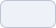 | Moon | `colors.moon` | `#EEF1F7` | Text |
|  | Breath | `colors.breath` | `#9DB4FF` | Accent: primary buttons, links, focus |
|  | Lamp | `colors.lamp` | `#F4B65F` | The one warm light: the key highlight, status marks. Use sparingly. |
|  | Airese navy | `colors.brand` | `#2E3A5A` | Logo, decks, Android icon background |
|  | White | `colors.white` | `#FFFFFF` | Logo on the splash, switch thumbs |
| 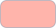 | Error | `colors.error` | `#FFB4AB` | Form errors only (Material 3 dark error) |

### Roles (what screens use)

| Role | Token | Value |
| --- | --- | --- |
| Background | `colors.background` | Midnight |
| Surface | `colors.surface` | Deep |
| Text | `colors.text` | Moon |
| Muted text | `colors.textMuted` | Mist |
| Accent | `colors.accent` | Breath |
| Text on accent | `colors.onAccent` | Midnight (white on Breath is too low-contrast) |
| Divider  | `colors.divider` | Mist at 18% |
| Scrim 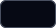 | `colors.scrim` | Night at 70%, behind sheets |

### Data colours

One colour per kind of data, the same everywhere: charts, data icons, legends, score rings. **Marks and icons only, never text, buttons or links.** Every chart also labels or shapes its marks, so colour is never the only cue. Checked together on Deep and Midnight for colour-blind separation (ΔE 12+) and 3:1+ contrast.

| | Data | Token | Hex | Soft tint (icon badges, level chips) |
| --- | --- | --- | --- | --- |
|  | Snoring | `colors.dataSnoring` | `#FFAA5C` (Ember) | 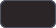 `colors.tintSnoring` |
|  | Breathing pauses | `colors.dataBreathing` | `#B9A3FF` (Iris) |  `colors.tintBreathing` |
|  | Sleep and rest | `colors.dataSleep` | `#8EE3CF` (Dew) | 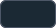 `colors.tintSleep` |
| | Warm wash | `colors.tintWarm` | Lamp at 10% | 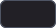 for the "what it means" card |

Breath stays out of charts: it's the UI colour, and too close to Iris for colour-blind readers. Earlier nights in charts use a neutral grey (`rgba(238,241,247,0.14–0.16)`).

### Loudness ramp

`loudness` in tokens: one hue, light to deep, so louder reads as stronger. Magnitude, so never a rainbow, and never red.

| | Level | Token | Hex |
| --- | --- | --- | --- |
| 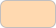 | Light | `loudness.light` | `#FFD9B0` |
|  | Moderate | `loudness.moderate` | `#FFC285` |
|  | Loud | `loudness.loud` | `#FFAA5C` |
|  | Very loud | `loudness.veryLoud` | `#F28B3D` |

### Gradients

| | Name | Token | Stops (top to bottom) | Used for |
| --- | --- | --- | --- | --- |
|  | Splash | `gradients.splash` | `#0B1020` → `#1C3470` → `#225ED8` | Splash, Home and Recording backgrounds (`AmbientGradient`), the record button's fill |
|  | Hero | `gradients.hero` | `#1C3470` → `#19294E` | The verdict card on Recording Details (Moon text stays at 11:1+) |

### Status marks

A night's headline carries a small colour-coded icon (`statusMark()` in `src/lib/nightDetails.ts`). Calm, never red.

| State | Icon | Colour |
| --- | --- | --- |
| Ordinary | `check_circle` | Dew |
| Unusual | `trending_up` | Lamp |
| Repeated pattern | `visibility` | Lamp |
| First night, other | `bedtime` | Mist |

---

## 2. Typography

**Montserrat** (Google Fonts, via `@expo-google-fonts/montserrat`). **Two weights in use: regular (400) and semibold (600).** Medium (500) and bold (700) are loaded but not used by the type scale.

| Variant | Size / line height | Weight | Used for |
| --- | --- | --- | --- |
| `title` | 32 / 40 | Semibold | Page titles, big numbers |
| `headline` | 24 / 32 | Semibold | Onboarding headlines, initials in the profile avatar |
| `heading` | 20 / 28 | Semibold | Card and sheet titles, the recording clock |
| `body` | 16 / 24 | Regular | All reading text (the base) |
| `small` | 14 / 22 | Regular | Secondary detail, labels, legends |
| `caption` | 12 / 18 | Regular | The minimum: credits, fine print, version |
| `button` | 16 / 20 | Regular | Button labels, row titles |

- **Scale:** steps of about 1.25 (major third): 12 · 14 · 16 · 20 · 24 · 32. **Nothing smaller than 12.**
- **Line height:** at least 1.5× for reading text (WCAG 1.4.8).
- **Recording Details** uses four sizes only: 32, 20, 16, 14.
- **Big numbers:** one size and weight, with no small units. Durations are compact ("7h 36m").
- **Group titles in forms:** uppercase, 1 pt letter spacing.
- **Dynamic Type:** text scales with the system setting up to 200% (`maxFontSizeMultiplier={2}` in `AppText`).
- **Digits:** times and clocks use tabular figures, so they don't jump as they change.
- **Exception:** the browser-only system alert stand-in uses the system font on purpose.

---

## 3. Spacing, corners and layout

### Spacing (4-pt grid), `space`

| Token | Value | Typical use |
| --- | --- | --- |
| `xs` | 4 | Text to its subtitle |
| `sm` | 8 | Icon to label, small gaps |
| `md` | 12 | Between related items |
| `lg` | 16 | Inside rows, between cards in a pair |
| `xl` | 24 | Between sections, card padding inside sheets |
| `xxl` | 32 | Big separations, footers |
| `gutter` | 20 | **The one screen edge** for every screen (iOS standard); also `PAGE_SIDE` |

### Corners, `radius`

| Token | Value | Used for |
| --- | --- | --- |
| `md` | 12 | Small surfaces |
| `lg` | 16 | Cards, form groups |
| `xl` | 20 | Banners |
| `card` | 24 | Data cards (Recording Details) |
| `sheet` | 28 | Bottom sheet and large sheet tops |
| `pill` | 999 | Buttons, chips, toasts |

### Layout constants

| Constant | Value | Where |
| --- | --- | --- |
| Touch target | 44 pt minimum | Every control (buttons 48, icon buttons 56, setting rows 64) |
| Sticky top bar | 44 pt below the status bar | `DetailPage` |
| Tab bar clearance | 96 pt (`TAB_BAR_CLEARANCE`) | Bottom padding on tab screens |
| Form row | 52 pt minimum | `FormInput` |
| Safe areas | `useInsets()` | Every screen |

### Surfaces and depth

The UI is flat: depth comes from colour (Midnight → Deep), not shadows.

- **The exceptions:** soft Breath glows on the record button and the hero card, and a frosted Midnight bar (88%, blurred on web) behind sticky titles.

---

## 4. Motion

**Two presets, one feel: like settling down for the night.** Every animation uses one of these; nothing is hand-tuned per screen. Nothing snaps, bounces or overshoots. Swipes and scrolls follow the finger.

| Preset | Duration | easeOut (arriving) | easeIn (leaving) | easeInOut (between states) | Used for |
| --- | --- | --- | --- | --- | --- |
| `motion.slow` | 1200 ms | `bezier(0.3, 0, 0.2, 1)` | `bezier(0.47, 0, 0.745, 0.715)` | `bezier(0.37, 0, 0.63, 1)` | Arrivals: splash, the recording screen surfacing, charts growing in, score rings filling |
| `motion.fast` | 500 ms | `bezier(0.2, 0, 0, 1)` | `bezier(0.4, 0, 0.8, 0.4)` | `bezier(0.45, 0, 0.2, 1)` | Feedback: sheets, page slides, the record ring after a tap, toasts, the blinking colon |

| Helper | Value | Used for |
| --- | --- | --- |
| `motion.ambient` | 9000 ms, sine in-out | Looping background life: the gradient drift, the record button's breathing |
| `motion.attention` | 1800 ms, then 3000 ms rest | The light that runs once round the record ring to invite a tap |
| `motion.stagger` | 350 ms | Offset between steps, so things arrive in sequence, not all at once |
| `motion.useNativeDriver` | `false` on web | The native driver isn't available in the browser |

**Reduce Motion** (`useReducedMotion()`) is always respected:
- slides become fades;
- loops hold still;
- charts are drawn at once;
- the colon stops blinking.

---

## 5. Icons

**Material Symbols (Material 3), Outlined**, weight 400, grade 0, optical size 48, through the `Icon` component only. Paths are copied from the official set (`@material-symbols/svg-400`). `_fill` names are the filled variant, used for selected states.

| Group | Icons |
| --- | --- |
| Navigation | `chevron_left`, `chevron_right`, `arrow_forward`, `keyboard_double_arrow_right`, `close`, `home`, `home_fill` |
| Actions | `add`, `remove`, `edit`, `edit_note`, `delete`, `call`, `location_on`, `play_fill`, `pause_fill`, `stop_fill`, `check` |
| Recording and sound | `mic`, `mic_fill`, `graphic_eq`, `airwave`, `monitoring`, `history` |
| Sleep and time | `bedtime`, `bedtime_fill`, `schedule`, `schedule_fill`, `calendar_month`, `bed` |
| Status and trends | `check_circle`, `visibility`, `trending_up`, `trending_down`, `trending_flat`, `warning`, `error`, `info`, `lightbulb` |
| People and settings | `person`, `group`, `notifications`, `settings`, `lock`, `mail`, `description` |
| Tips | `battery_charging_full`, `do_not_disturb_on` |

**Native tab bar** (`src/app/(tabs)/_layout.tsx`):
- **Home:** SF Symbols `house` / `house.fill` on iOS; Material `home` on Android.
- **Recordings:** SF Symbols `waveform` on iOS; Material `graphic_eq` on Android.

**To add an icon:** copy its path from `outlined/<name>.svg` in the official set into `PATHS` in [`Icon.tsx`](../src/components/Icon.tsx), under the same name.

---

## 6. Brand assets

### Logo

| Stacked (mark above wordmark) | Horizontal |
| --- | --- |
| 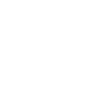 |  |
| [`airese-logo.svg`](../assets/brand/airese-logo.svg) · in code: `<Logo width color />` | [`airese-logo-hori.svg`](../assets/brand/airese-logo-hori.svg) · not yet used in the app |

- **On the splash:** white on the gradient.
- **In footers (Profile, Our centres):** Mist, 44 to 52 pt wide, with "Powered by The Air Station".
- **Next steps:** "Powered by The Air Station" also sits under the sticky next-step button on Recording Details.

### App icons and splash

| Asset | File | Notes |
| --- | --- | --- |
| iOS / default icon | [`assets/icon.png`](../assets/icon.png) | |
| Android adaptive icon | [`android-icon-foreground.png`](../assets/android-icon-foreground.png), [`-background.png`](../assets/android-icon-background.png), [`-monochrome.png`](../assets/android-icon-monochrome.png) | Background colour `#2E3A5A` (Airese navy) |
| Splash | [`assets/splash-icon.png`](../assets/splash-icon.png) | The animated splash itself is a screen (`SplashScreen.tsx`) |
| Favicon (web preview) | [`assets/favicon.png`](../assets/favicon.png) | |

### Illustrations

| Onboarding 1: Know your sleep | Onboarding 2: Completely private | Onboarding 3: Actionable insights |
| --- | --- | --- |
| 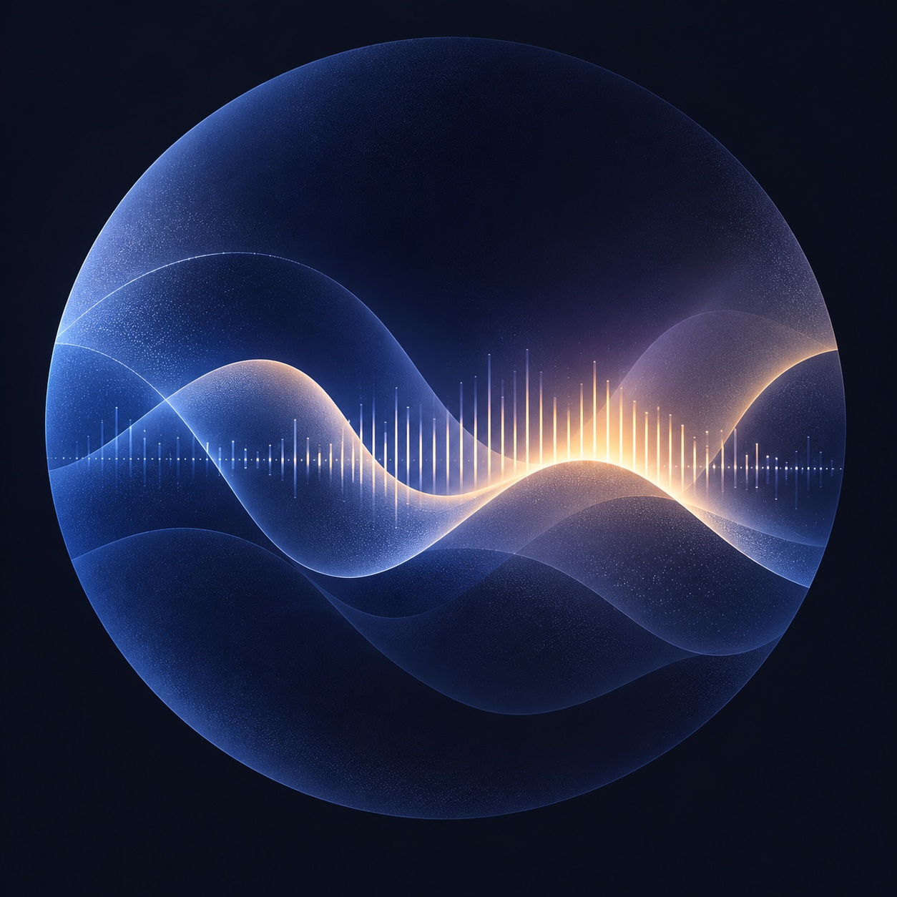 | 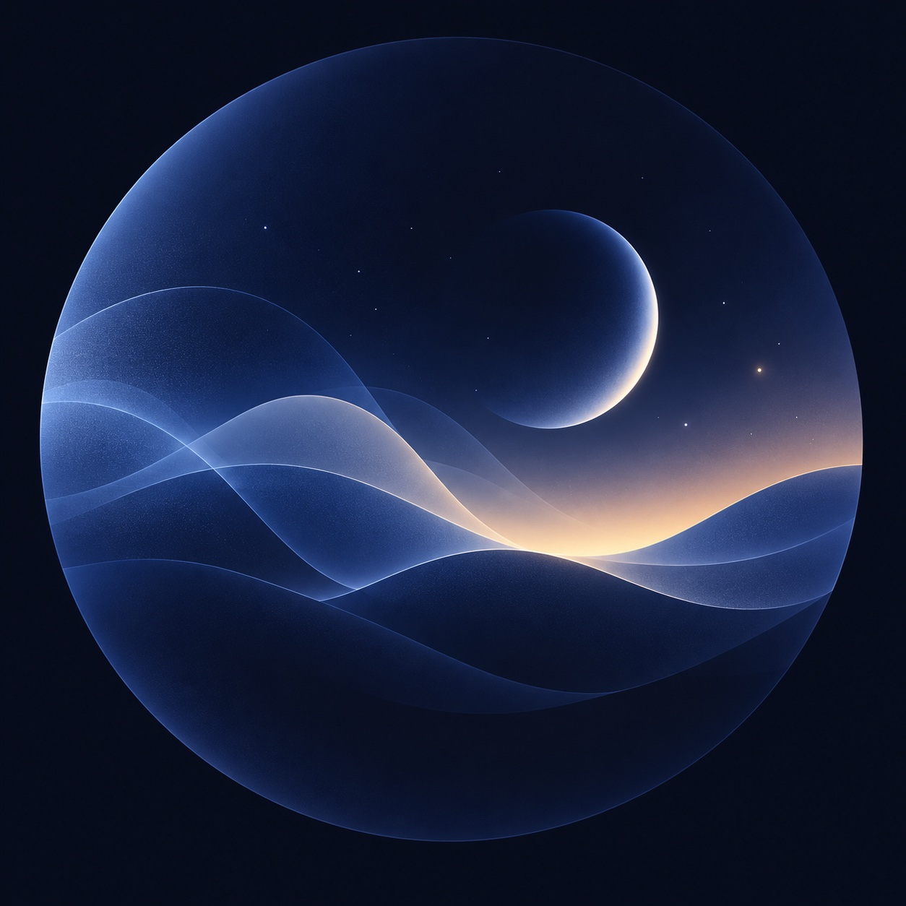 | 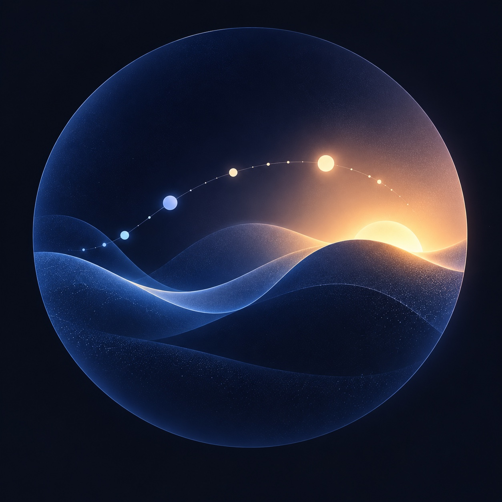 |

| Microphone permission | Notifications permission |
| --- | --- |
| 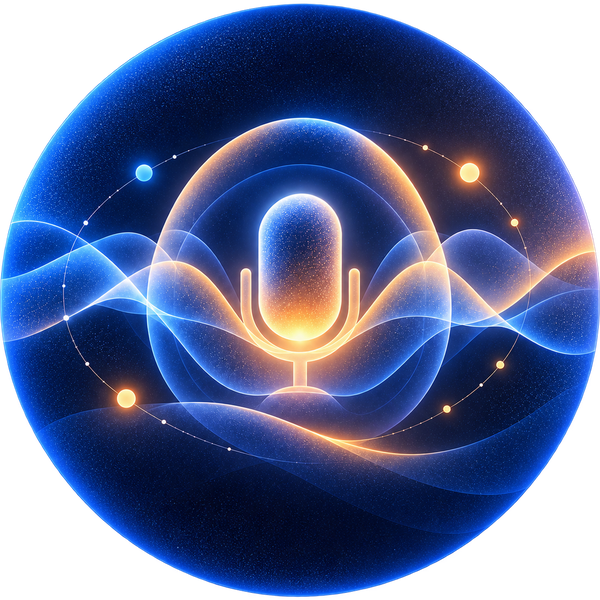 | 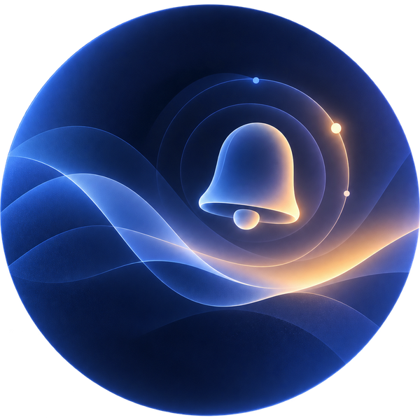 |

**Imagery direction** (BRAND.md): black and white, deep blue, real. Real people asleep in a dim room, toned blue, with an occasional warm bedside lamp. No stock-photo cheer or sci-fi glow.

### Fonts

Montserrat 400, 500, 600 and 700 via `@expo-google-fonts/montserrat`, loaded in [`src/app/_layout.tsx`](../src/app/_layout.tsx). On web the stack falls back to `Montserrat, system-ui, sans-serif`.

---

## 7. Components

All in [`src/components/`](../src/components/), imported from `'../components'`. Grouped by job. "Used in" lists the screens.

### Foundations

| Component | What it is | Key props | Used in |
| --- | --- | --- | --- |
| [`AppText`](../src/components/AppText.tsx) | The only text component. Applies a type variant and a colour token; scales to 200%. | `variant`, `color` | Everywhere |
| [`Icon`](../src/components/Icon.tsx) | A Material Symbol as SVG. | `name`, `size`, `color` | Everywhere |
| [`Logo`](../src/components/Logo.tsx) | The stacked Airese logo as SVG. | `width`, `color` | Splash, Profile, Our centres |

### Page structure and templates

| Component | What it is | Key props | Used in |
| --- | --- | --- | --- |
| [`PageTitle`](../src/components/PageTitle.tsx) | Large tab-page title with an optional trailing element (the avatar). Exports `PAGE_SIDE`. | `title`, `trailing`, `color` | Home, Recordings |
| [`DetailPage`](../src/components/DetailPage.tsx) | Template for any page opened from a row: "‹ Back", large title and subtitle, sticky frosted compact title on scroll, optional sticky footer. Slides itself in on web. | `backLabel`, `title`, `subtitle`, `onBack`, `footer(leave)` | Recording Details, Night Notes, Profile, Your details, Notifications, Our centres |
| [`AmbientGradient`](../src/components/AmbientGradient.tsx) | The splash blues with two soft glows drifting slowly. Static with Reduce Motion. | `width`, `height` | Home, Recording, Recordings |
| [`TabBar`](../src/components/TabBar.tsx) | Floating two-tab bar for web and the preview (native uses the platform tab bar). Exports `HOME_TABS`, `TAB_BAR_CLEARANCE`. | `items`, `selected`, `onSelect` | Web tabs layout, preview |
| [`Screen`](../src/components/Screen.tsx) | Background, safe areas, edges, status bar. | `children` | Not used (see Housekeeping) |

### Buttons and controls

| Component | What it is | Key props | Used in |
| --- | --- | --- | --- |
| [`Button`](../src/components/Button.tsx) | Pill button, 48 pt. `primary`: Breath fill, Midnight label. `quiet`: text only. | `label`, `onPress`, `variant` | Onboarding, permissions, sheets, footers |
| [`IconButton`](../src/components/IconButton.tsx) | Round 56 pt Breath button with a Midnight icon. Needs a label. | `icon`, `label`, `onPress` | Onboarding (Next) |
| [`InfoButton`](../src/components/InfoButton.tsx) | The (i) that opens an explanation. | `onPress`, `label`, `size`, `color` | Onboarding, details, Recording, cards |
| [`Avatar`](../src/components/Avatar.tsx) | 44 pt round initials (or a person icon); opens Profile. | `initials`, `onPress` | Home, Recordings |
| [`ToggleChip`](../src/components/ToggleChip.tsx) · `ChipGroup` | Multi-select pill (reads as a checkbox) and the wrapping row that holds them. Off: faint outline; on: Deep fill, Breath outline, check. | `label`, `selected`, `onToggle` | Night Notes |
| [`SettingSwitch`](../src/components/SettingRows.tsx) | A plain label and a native switch (Breath track, white thumb). Greyed out when disabled. | `title`, `value`, `enabled`, `onChange` | Notifications |
| [`SegmentedControl`](../src/components/SegmentedControl.tsx) | iOS-style segmented control with a sliding Breath thumb. Radio group for screen readers. | `segments`, `selected`, `onSelect` | Not used (see Housekeeping) |

### Forms and rows

| Component | What it is | Key props | Used in |
| --- | --- | --- | --- |
| [`FormGroup`](../src/components/Form.tsx) | iOS Settings-style group: uppercase title, Deep card, optional footer. Outlines in Breath while focused, in error red with an icon and message on error. | `title`, `titleAction`, `footer`, `error`, `row` | Your details (onboarding and Profile), Profile, Notifications |
| [`FormInput`](../src/components/Form.tsx) | A plain native text input row (52 pt), with an optional trailing control. | TextInput props, `trailing` | Your details |
| [`FormDivider`](../src/components/Form.tsx) | Hairline between rows (or between inputs in a row group). | `vertical` | Forms, Profile groups |
| [`SettingRow`](../src/components/SettingRows.tsx) | Row inside a group: icon, title, optional detail; a chevron opens a page, an action pill does something here ("Turn on"). 64 pt. | `icon`, `title`, `detail`, `chevron`, `action`, `disabled`, `onPress` | Profile, Notifications |
| [`SettingsCard`](../src/components/SettingsCard.tsx) · `SettingsRow` | Breath-outlined card of tappable rows (icon, title, detail, trailing hint, optional Lamp caution). | `title`; row: `icon`, `title`, `subtitle`, `trailing`, `alert` | Home (Night Notes) |

### Cards

| Component | What it is | Key props | Used in |
| --- | --- | --- | --- |
| [`Card`](../src/components/Card.tsx) | Deep surface, 16 pt corners, 20 pt padding, optional title row with (i). | `title`, `onInfo` | Inside `InsightCard` |
| [`InsightCard`](../src/components/InsightCard.tsx) | A plain-language takeaway. Tones: `plain`, `hero` (verdict: Deep lifting into blue with a Breath glow), `warm` (Lamp wash, "what it means"). | `title`, `body`, `lead`, `icon`, `iconColor`, `tone`, `onInfo` | Recording Details |
| [`DataCard`](../src/components/DataCard.tsx) · `BigNumber` | The Recording Details card: label with the data's icon, a visual or big number, one line of insight, "›" for more. Shapes: `wide`, `square`. | `shape`, `icon`, `tone`, `label`, `title`, `insight`, `onPress` | Recording Details |
| [`ScoreTile`](../src/components/ScoreTile.tsx) | Headline score, half width: a big ring in the data's colour with the number (or icon) inside, the name, a level word on a tint, a trend line. | `tone`, `fraction`, `value` or `icon`, `name`, `level`, `detail` | Recording Details (Sound Score, Breathing pauses) |

### Sheets and feedback

| Component | What it is | Key props | Used in |
| --- | --- | --- | --- |
| [`BottomSheet`](../src/components/BottomSheet.tsx) | The base sheet: dimmed backdrop, glides up; tap outside or drag down to close. `fit` sizes to content; `dragFrom="top"` for scrolling content. | `visible`, `onClose`, `fit`, `dragFrom` | Confirmations, remedies, explanations |
| [`ExplainSheet`](../src/components/ExplainSheet.tsx) | Small explanation: title, a few sentences, optional action, "Got it". | `content`, `onClose`, `action` | Recording Details, Profile (About) |
| [`LargeSheet`](../src/components/LargeSheet.tsx) | Near full-height sheet for "more" on a card, with a title, × and drag-down. | `visible`, `title`, `onClose` | Recording Details (score, snoring, breathing, sleep, clips, recent nights, night report) |
| [`PermissionSheet`](../src/components/PermissionSheet.tsx) | A second chance at a permission; picks "why it matters" or "open Settings" from where the permission stands. | `kind`, `visible`, `onAllowed`, `onNotNow` | Home, Profile, Notifications, permission screens |
| [`Toast`](../src/components/Toast.tsx) | A short confirmation pill with a check; fades in and out; announced once to screen readers. | `message`, `onDone` | Profile (after deleting recordings) |
| [`SystemAlertHost`](../src/components/SystemAlertHost.tsx) | **Browser preview only.** Stand-in for the iOS permission alert (iOS styling on purpose). Renders nothing on device. | — | Root layout, preview |

### Recording

| Component | What it is | Key props | Used in |
| --- | --- | --- | --- |
| [`RecordDial`](../src/components/RecordDial.tsx) | The record button: a round mic inside a ring of ticks. Tap lights the ring, then starts. At rest it breathes gently, and a light runs round the ring now and then. | `size`, `note`, `ready`, `onStart(rect)` | Home |
| [`ListeningRing`](../src/components/ListeningRing.tsx) | The stop button inside bars that rise and fall like a calm sound level. Blues only. | `size`, `onStop` | Recording |

### Data visualisation

| Component | What it is | Key props | Used in |
| --- | --- | --- | --- |
| [`SnoringChart`](../src/components/SnoringChart.tsx) | The night's sound level as one filled shape in the loudness ramp, against 40/60/80 dB; events above (pause pill, cough diamond, movement ring). `overview`: tap to pick a moment to hear. `explore`: playhead readout, pinch to zoom, − / + buttons. | `d`, `mode`, `height`, `moments`, `selected`, `onSelect` | Recording Details, its sheets, night report |
| [`NightTimeline`](../src/components/NightTimeline.tsx) | Snoring bars every 3 minutes, breathing ticks, an asleep line with gaps; `full` adds tappable clip rings. Exports `asleepStretches`. | `details`, `full`, `clips`, `onClip` | All clips sheet |
| [`ScoreRing`](../src/components/ScoreRing.tsx) | A ring filled to a fraction, icon or number inside; fills in on arrival. Exports `scoreColor`. | `fraction`, `color`, `icon`, `size`, `stroke`, `children` | `ScoreTile` |
| [`BenchmarkScale`](../src/components/BenchmarkScale.tsx) | A bar split into named zones, tonight's zone filled, a marker for tonight and a tick for your usual. | `b`, `color` | Score sheets, night report |
| [`HourlyBars`](../src/components/HourlyBars.tsx) | Minutes (or counts) per hour of the night, the busiest labelled; `compact` sparkline. | `hours`, `compact`, `color`, `what`, `unit` | Snoring tile, snoring and breathing sheets |
| [`LoudnessBars`](../src/components/LoudnessBars.tsx) | How snoring split by loudness: dot, level, bar, share; `compact` stacked bar. | `share`, `compact` | Snoring sheet |
| [`RecentNightsChart`](../src/components/RecentNightsChart.tsx) | Last 7 nights as bars, tonight in Ember with its value, a dashed line at your usual. | `nights`, `usual`, `format` | Recent nights card and sheet |
| [`ComparisonIndicator`](../src/components/ComparisonIndicator.tsx) | Trend arrow and plain words ("Less than usual"), in neutral Mist: no green for good, no red for bad. | `trend`, `words` | Tiles, recent nights sheet |

### Audio

| Component | What it is | Key props | Used in |
| --- | --- | --- | --- |
| [`ClipPlayer`](../src/components/ClipPlayer.tsx) | The large player: time, detail line, waveform that fills as it plays, framed **Pause** (dashed Iris) and **Loud breath** (solid Ember) marks, scrubber, round play/pause. | `clip`, `time`, `player`, `detail` | Your night in sound |
| [`AudioSnippet`](../src/components/AudioSnippet.tsx) · `useClipPlayer` | A compact clip row (play, time, length, plain label, small waveform), and the shared player state for all clips on a page. Exports `clipColor`. | `clip`, `time`, `player` | All clips sheet |

### Recording Details parts

| Component | What it is | Key props | Used in |
| --- | --- | --- | --- |
| [`CareCTA`](../src/components/CareCTA.tsx) | The sticky next step: "Keep tracking", or "Talk to a sleep care team" for a repeated pattern; "Powered by The Air Station" under it. | `concern`, `onPress` | Recording Details |
| [`PrivacyFooter`](../src/components/PrivacyFooter.tsx) | "Private by design" page footer: a large lock, one line, a link to more. Not a card. | `onMore` | Recording Details |

---

## 8. Hooks and helpers

| Name | File | What it does |
| --- | --- | --- |
| `useInsets()` | [`src/theme/useInsets.ts`](../src/theme/useInsets.ts) | Safe-area insets (status bar, home indicator), including inside the preview's phone frame. |
| `useReducedMotion()` | [`src/theme/useReducedMotion.ts`](../src/theme/useReducedMotion.ts) | The system Reduce Motion setting. |
| `motion` | [`src/theme/motion.ts`](../src/theme/motion.ts) | The presets in section 4. |
| `colors`, `loudness`, `gradients`, `space`, `radius`, `type` | [`src/theme/tokens.ts`](../src/theme/tokens.ts) | The tokens in sections 1 to 3. |
| `formatDuration`, `formatClock`, `shortDuration`, `clockAt` | `src/lib/time.ts`, `src/lib/nightDetails.ts` | Plain time formats: "6 hr 30 min", "6:20 am", "7h 36m". Never `toLocaleString` (it differs by device). |
| `statusMark(state)` | `src/lib/nightDetails.ts` | The icon and colour for a night's headline. |

---

## 9. Patterns

| Pattern | How it's built |
| --- | --- |
| **Levels of detail** | L1 the page → L2 a small `ExplainSheet` for "why?" → a `LargeSheet` for "more" on a card. Dismissing returns to exactly where the user was. |
| **Pages from a row** | `DetailPage`: system push on device (slide in, swipe back); slides itself in on web. Back names where it goes. |
| **Grouped settings** | `FormGroup` cards holding `FormInput`, `SettingRow` or `SettingSwitch`, separated by `FormDivider`. |
| **Edit with a draft** | Edits are local until **Save** (sticky footer); Back discards them. Each field is checked on leaving it and again on Save. |
| **Confirm, then confirm it happened** | A `BottomSheet` with a plain title, what will happen, the action (named), and Cancel. Then a `Toast`. |
| **Permissions** | Ask in onboarding; never a wall; ask again in context with `PermissionSheet`, which switches to "Open Settings" once the system won't ask again. |
| **Empty states** | An icon, one heading, one helpful sentence that says what to do ("Tap the record button on Home at bedtime…"). |
| **Charts** | A sentence above every chart. Single series has no legend; two or more get a legend with shapes. Each has a text alternative. Grows in once with the slow preset. |
| **Numbers** | One big number, no small units. Levels are words (Low, Moderate, High; Rarely, Sometimes, Often), never colour alone. |
| **Brand presence** | Quiet: the logo in Mist with "Powered by The Air Station" at the end of Profile and Our centres, and under the next-step button on Recording Details. |

---

## 10. Accessibility

Target: **WCAG 2.2 AAA.**

- **Contrast:** 7:1 for text. Moon and Mist pass on Midnight and Deep; Midnight on Breath is 9.4:1. Data colours need 3:1 for marks.
- **Targets:** 44 pt minimum for every control.
- **Text size:** nothing below 12 pt; scales to 200%.
- **Colour is never the only cue:** words for levels, shapes for chart events, legends.
- **Motion:** Reduce Motion is respected everywhere.
- **Gestures:**
  - every gesture has a one-finger alternative (zoom buttons for pinch, a grabber tap for pull-down);
  - charts are adjustable for screen readers (swipe up or down to step);
  - a hold never ends the night (stopping confirms).
- **Screen readers:**
  - every control has a label;
  - charts and score tiles have spoken summaries;
  - toasts and live values use polite live regions;
  - decorative images are hidden.

---

## 11. Dependencies

Design-relevant packages (all Expo SDK 57 compatible):

| Package | For |
| --- | --- |
| `react-native` 0.86, `react-native-web` | UI, browser preview |
| `react-native-svg` | Icons, logo, charts, rings, gradients |
| `@expo-google-fonts/montserrat`, `expo-font` | Type |
| `expo-router` (native tabs) | Navigation, tab bar |
| `react-native-safe-area-context` | Safe areas |
| `expo-splash-screen`, `expo-status-bar` | Launch, status bar style |
| `expo-audio`, `expo-notifications` | Microphone and notification permissions |
| `expo-constants` | App version in Profile |
| `expo-linking` | Call and directions links |
| `expo-haptics` | Installed, not yet used |

---

## 12. Housekeeping

Things to tidy or decide before handover:

- **Unused:**
  - `Screen` and `SegmentedControl` are in the library but not used by any screen;
  - the horizontal logo (`airese-logo-hori.svg`) and `expo-haptics` aren't used.
  
  Keep them or remove them.
- **Overlaps:**
  - `SettingsCard` / `SettingsRow` (Home) and `SettingRow` (Profile) do similar jobs in different styles. Consider merging.
  - `NightTimeline` and `SnoringChart` both draw the night. The timeline now only appears in the All clips sheet.
- **Unused weights:** Medium (500) and Bold (700) are loaded but not used by the type scale.
- **Brand navy:** its role in the dark UI is still open (BRAND.md).

---

## 13. Adding to the system

1. **Check first:** can an existing token or component do it? Keep the system small.
2. **Tokens:** add to `tokens.ts` with a comment saying what it's for. Colours need a contrast check (7:1 for text, 3:1 for marks); data colours also need a colour-blind check.
3. **Components:** one file in `src/components/`, exported from `index.ts`. Start with a short doc comment: what it is, how it behaves, its Reduce Motion behaviour, how it reads to screen readers.
4. **Motion:** use `motion.slow` or `motion.fast` and one of their curves. Never a new duration or curve.
5. **Icons:** copy the official Material Symbols path into `Icon.tsx`.
6. **This page:** update it in the same change.
